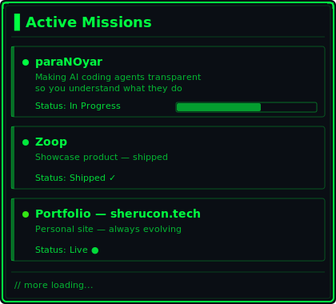

<!-- ╔══════════════════════════════════════════════════════════════════╗ -->
<!-- ║                    SHERUCON TERMINAL v1.0                       ║ -->
<!-- ║          github.com/sherucon — Establishing connection...       ║ -->
<!-- ╚══════════════════════════════════════════════════════════════════╝ -->

  

<!-- ═══════════════════ TYPING ANIMATION ═══════════════════ -->

  

<!-- ═══════════════════ DASHBOARD GRID ═══════════════════ -->

<table>
<tr>
<td width="50%" valign="top">

<!-- ▌ ACTIVE MISSIONS PANEL -->

  

</td>
<td width="50%" valign="top">

<!--  -->

</td>
</tr>
</table>

<!-- ═══════════════════ ACTIVITY LOG ═══════════════════ -->

  

<!-- ═══════════════════ TECH STACK ═══════════════════ -->

<h2>
  
</h2>

  

  

<!-- Domain badges -->

<!-- ═══════════════════ SNAKE CONTRIBUTION GRAPH ═══════════════════ -->

<h2>
  
</h2>

  <picture>
    <source media="(prefers-color-scheme: dark)" srcset="https://raw.githubusercontent.com/sherucon/sherucon/output/github-snake.svg" />
    <source media="(prefers-color-scheme: light)" srcset="https://raw.githubusercontent.com/sherucon/sherucon/output/github-snake-dark.svg" />
    
  </picture>

<!-- ═══════════════════ CONNECT ═══════════════════ -->

<h2>
  
</h2>

<!-- ═══════════════════ FOOTER ═══════════════════ -->

  

  

<!-- ═══════════════════ EOF ═══════════════════ -->
<!-- "We're moving fast in a direction where trust is assumed, not earned. I'd like to work on fixing that." -->
